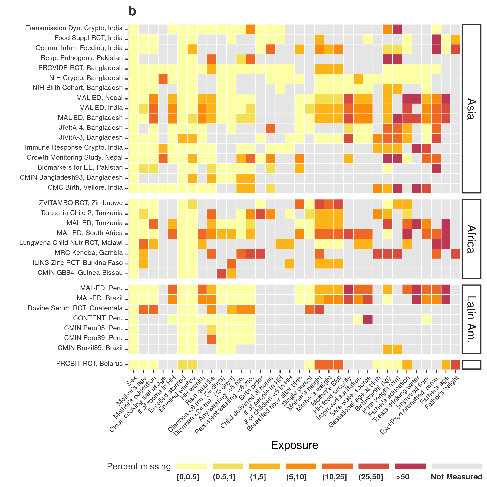
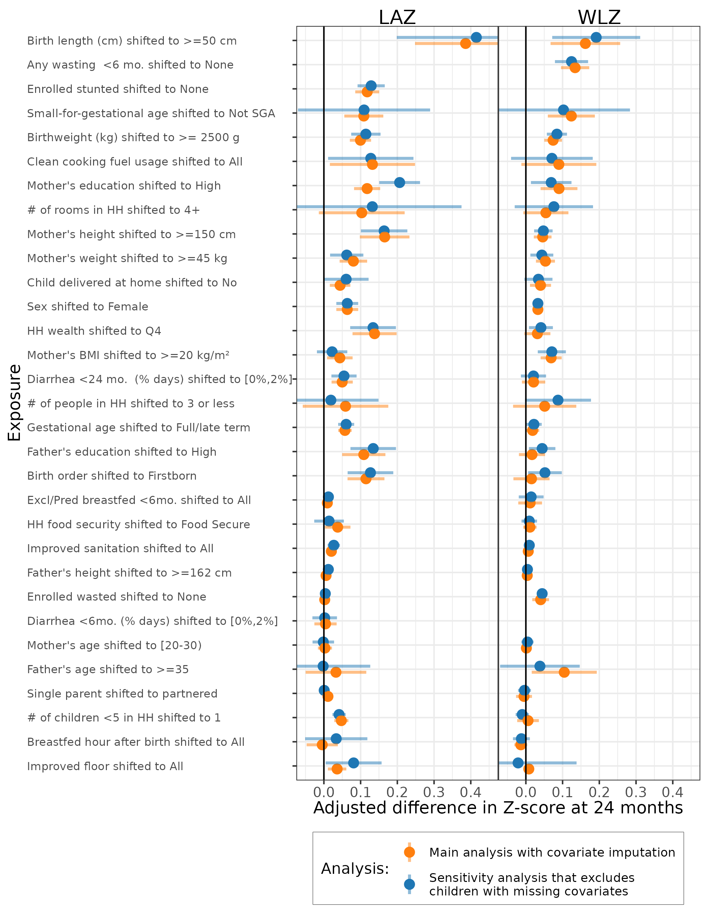

# Complete-Case Sensitivity Analyses {#missing}

---
output:
  pdf_document:
    keep_tex: yes
fontfamily: mathpazo
fontsize: 9pt
---

\raggedright

## Overview

__Purpose: __
__Interpretation: __
__Implications: __

### Heatmap of covariate missingness by study

<!-- -->

### Sensitivity analysis to complete case versus median/mode imputed analyses

The median absolute difference in pooled Z-scores was 0.009 and the mean absolute difference was 0.022.

<!-- -->

