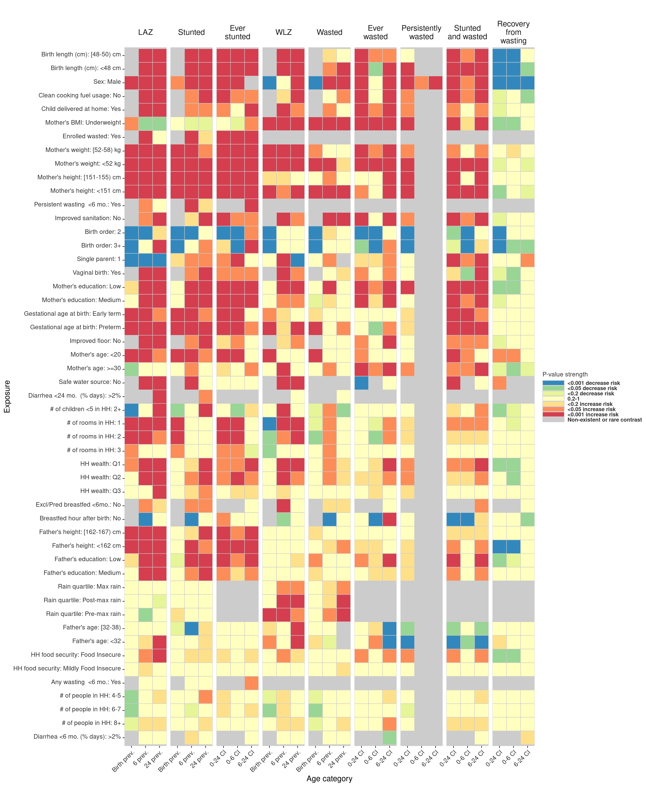
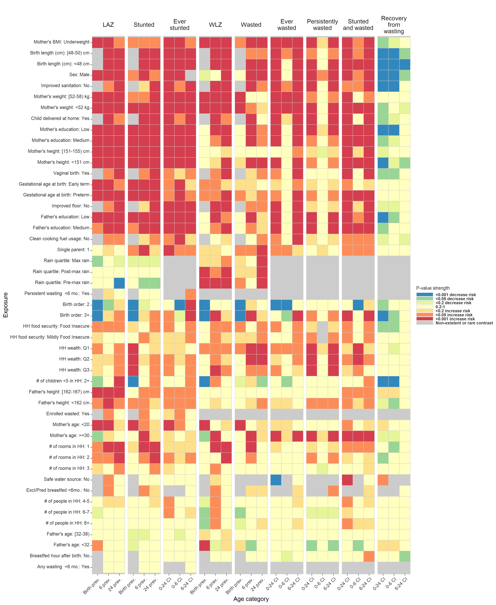

# Heatmaps {#heatmaps}

---
output:
  pdf_document:
    keep_tex: yes
fontfamily: mathpazo
fontsize: 9pt
---

\raggedright

## Overview

__Purpose: __
__Interpretation: __
__Implications: __

The heatmaps below are of the same design as Extended Data Figure 2, and show the significance and direction of estimates through the cell colors, separated across primary outcomes by child age. Red and orange cells are harmful exposures, while blue and green cells are protective exposures. The outcomes are labeled at the top of the columns, with each set of three columns the set of three ages analyzed for that outcome.  Each row is a level of an exposure variable, with reference levels excluded.  Rows are sorted top to bottom by increasing average p-value. Grey cells denote comparisons that were not estimated or could not be estimated because of data sparsity in the exposure-outcome combination. The first plot included region-stratified estimates, the second shows significance of estimates pooled across cohorts using fixed effects models, and the third shows significance of unadjusted estimates.

## Heatmap of significance of estimates, region stratified

## Heatmap of significance of estimates pooled using fixed effects

<!-- -->

## Heatmap of significance of estimate, unadjusted 

<!-- -->
