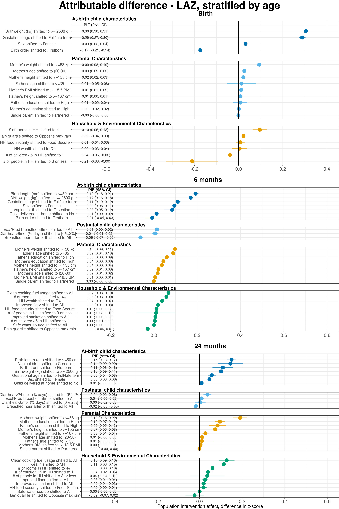
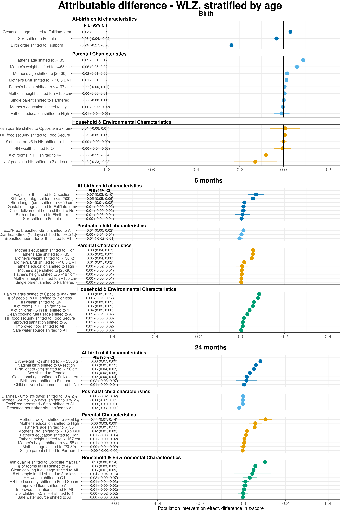
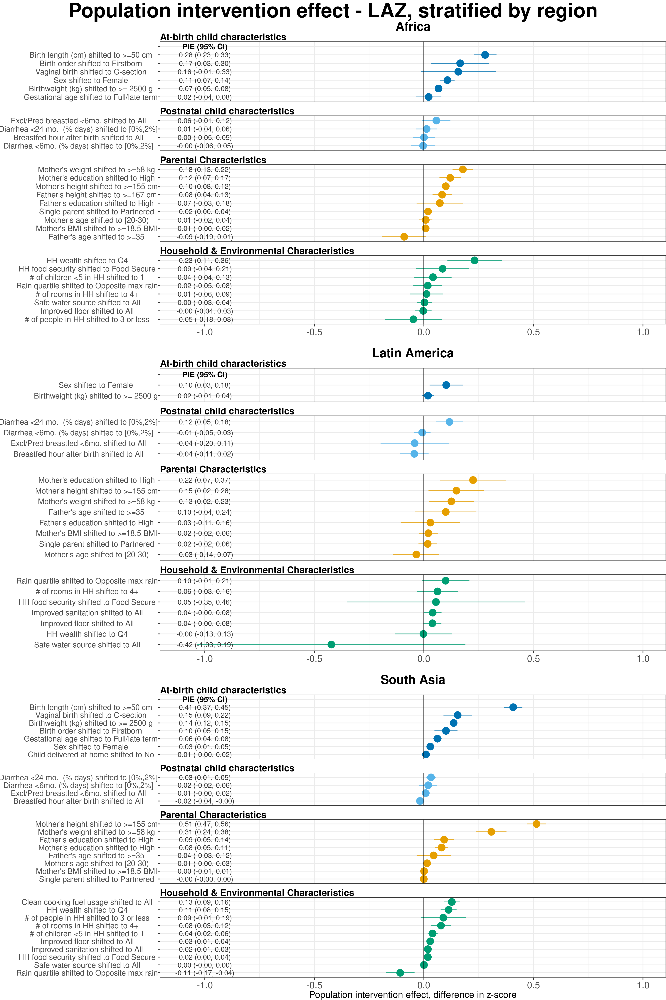
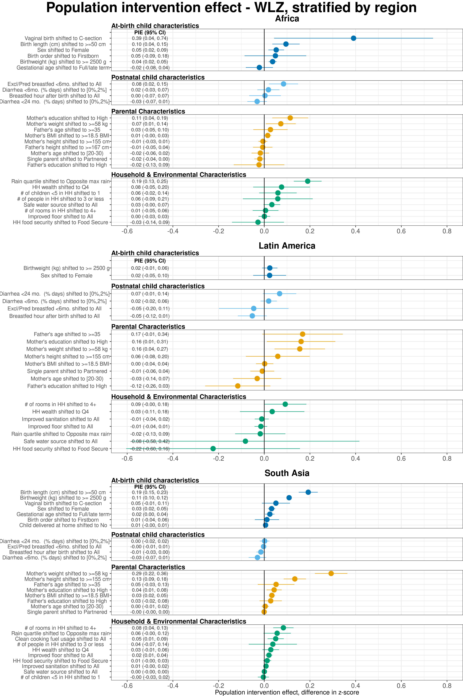

# Unadjusted Population Attributable Difference plots {#unadjusted}

---
output:
  pdf_document:
    keep_tex: yes
fontfamily: mathpazo
fontsize: 9pt
---

## Overview

__Purpose: __
__Interpretation: __
__Implications: __

\raggedright

## Age-stratified population attributable differences in length-for-age Z-scores, pooled using fixed effects models.

Exposures, rank ordered by population attributable difference on child LAZ, stratified by the age of the child at the time of anthropometry measurement. The population attributable difference is the expected difference in population mean Z-score if all children had the reference level of the exposure rather than the observed distribution. For all plots, reference levels are printed next to the name of the exposure. Estimates are adjusted for all other measured exposures not on the causal pathway, and are pooled using fixed effects models.
 

## Age-stratified population attributable differences in weight-for-length Z-scores, pooled using fixed effects models.

## Region-stratified population attributable differences in length-for-age Z-scores, pooled using fixed effects models.

## Region-stratified population attributable differences in weight-for-length Z-scores, pooled using fixed effects models.

