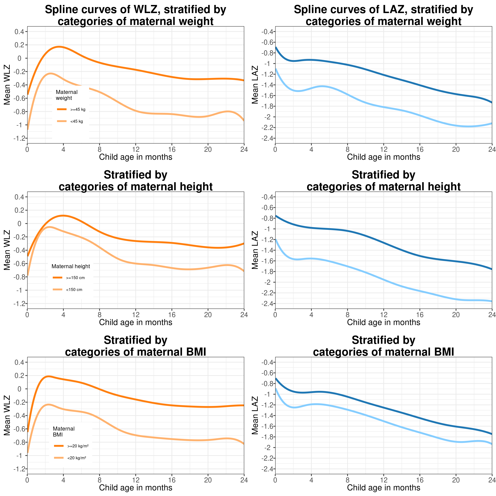
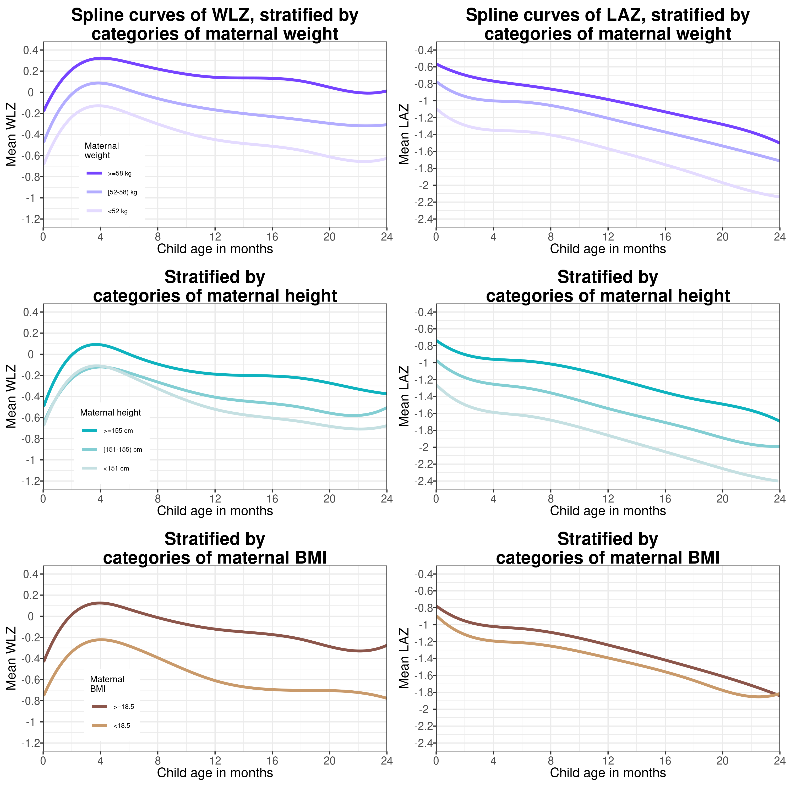
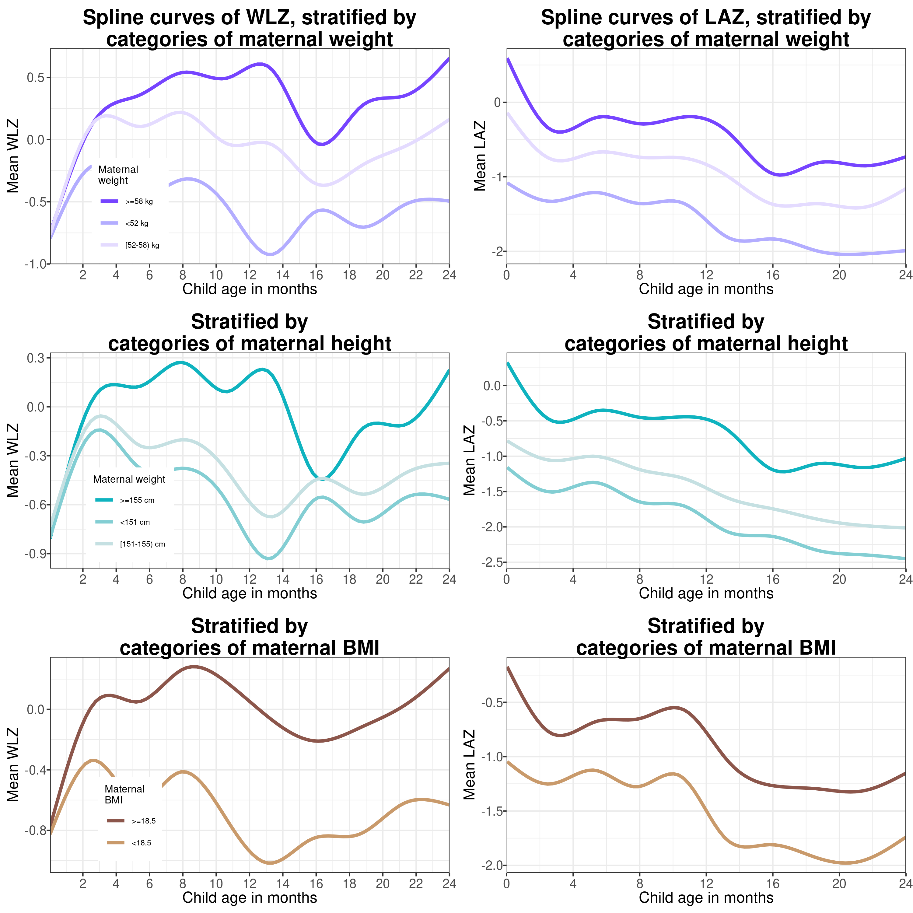
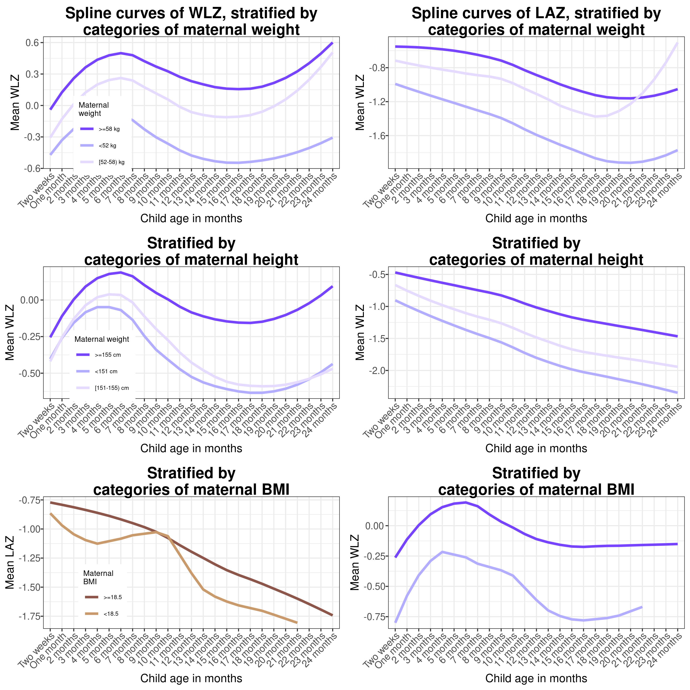

# Sensitivity spline plots {#sens_splines}

---
output:
  pdf_document:
    keep_tex: yes
fontfamily: mathpazo
fontsize: 9pt
---

\raggedright

## Overview

__Purpose: __
__Interpretation: __
__Implications: __

### Primary spline figures  - meta-analysis of cohort specific splines

### Spline figures - meta-analysis of cohort specific splines, different parameters

Centered at age = 1 says and with 6 degrees of freedom 

### Primary spline figures - Single spline fit to all the data

### Primary spline figures - splines fit through meta-analyses of monthly means of Z-scores 

