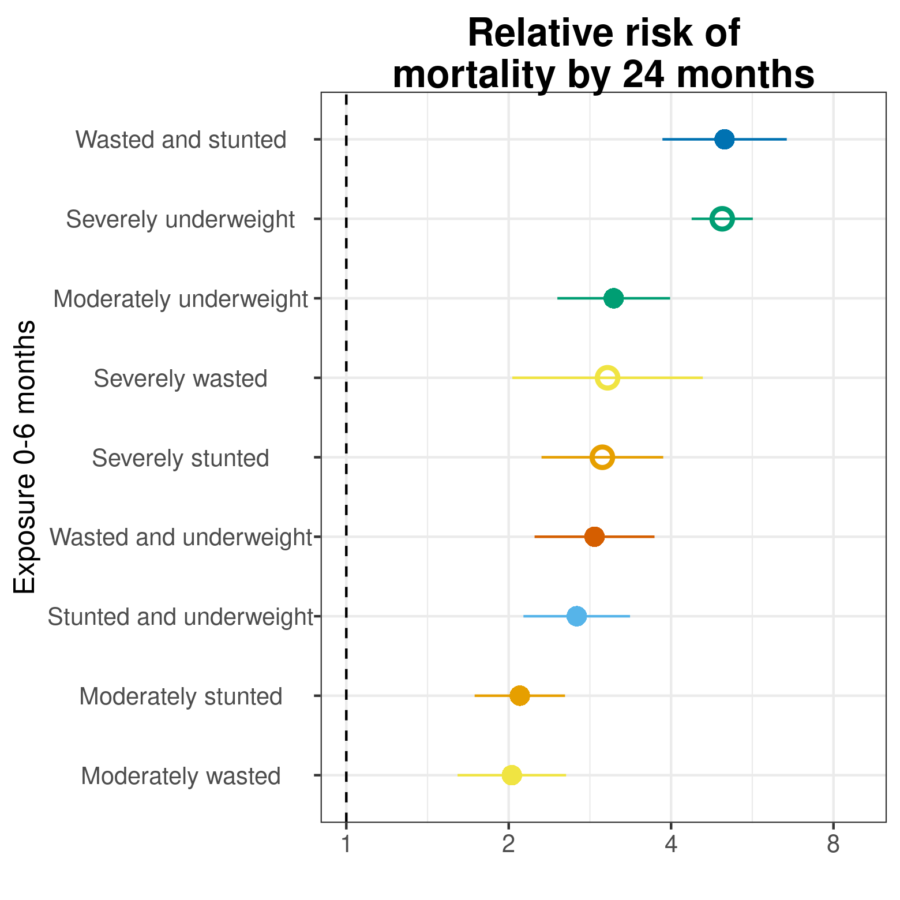
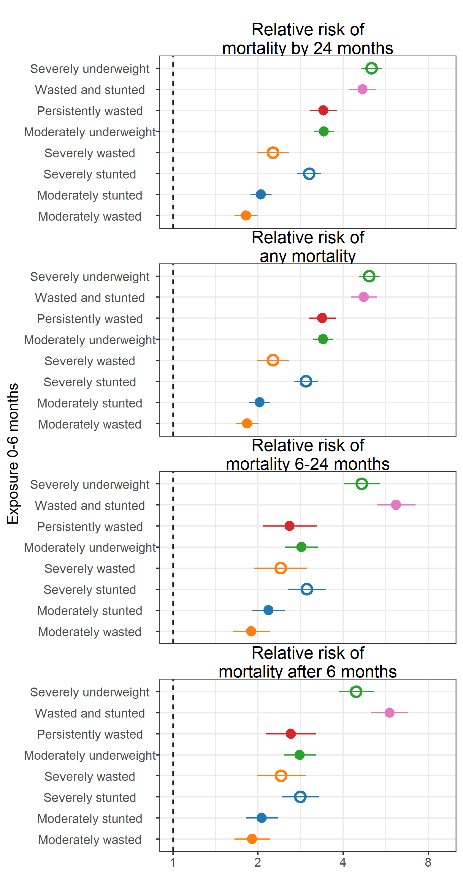
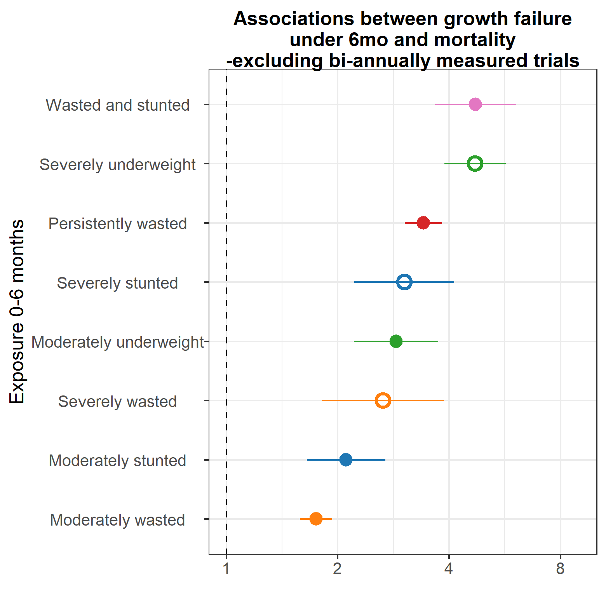

# Mortality Sensitivity Analyses {#mortality}

---
output:
  pdf_document:
    keep_tex: yes
fontfamily: mathpazo
fontsize: 9pt
---

\raggedright


### Comparisons of associations between early growth failure and different ages of mortality 




### Comparisons of associations between early growth failure and different ages of mortality, pooled using fixed effects




### Comparisons of associations between early growth failure and different ages of mortality, dropping biyearly-measured cohorts 




### Comparisons of associations between early growth failure and mortality and serious growth failure, stratified  by region


### Comparisons of associations between early growth failure and mortality and serious growth failure, pooled using fixed effects


<!-- ### Other -->

<!-- ```{r, echo = FALSE} -->


<!-- include_graphics(paste0(fig_dir, "/risk-factor/fig-mort+morb-RR.png")) -->
<!-- include_graphics(paste0(fig_dir, "/risk-factor/fig-mort+morb-RR_FE.png")) -->
<!-- include_graphics(paste0(fig_dir, "/risk-factor/fig-mort-024.png")) -->
<!-- include_graphics(paste0(fig_dir, "/risk-factor/fig-mort-024_FE.png")) -->
<!-- include_graphics(paste0(fig_dir, "/risk-factor/fig-mort-RR.png")) -->

<!-- ``` -->
