# Relative risk plots {#RR}

---
output:
  pdf_document:
    keep_tex: yes
fontfamily: mathpazo
fontsize: 9pt
---

\raggedright

## Overview

__Purpose: __

The primary parameter presented in the “Causes and Consequences of Child Growth Failure in Low- and Middle-income Countries” publications is the population intervention effect (PIE), the change in mean population Z-score if a exposure is shifted to the lowest-risk level, which combines the increase of risk associated with an exposure with the prevalence of the exposure in the population. This page of the supporting information presents plots for pooled relative risks (RR) and average treatment effects (ATE) for each level of each exposure. Relative risk are reported for binary CGF outcomes (stunting, wasting, underweight, severe stunting, severe wasting, and severe underweight) and ATEs are reported for continuous Z-score outcomes.

__Interpretation: __

The primary purpose of this page is to present the pooled point estimates and confidence intervals for all of the results summarized in the Extended Data Figure 2 heatmap, and to allow the reader to compare the levels of risk across categorical exposures. The population intervention effects and attributable fraction presented in the primary manuscript show the result when shifting the exposure distribution to the low-risk reference levels, but the results presented here allow for comparing other exposure levels, like food secure versus moderately food insecure.

__Implications: __

The strong risk factors identified through the use of Population Attributable Factors (Extended Data Figure 6) were almost always the strongest risk factors when examining average treatment effects and relative risks across different age categories and outcomes.

<!-- <<<<<<< HEAD:08-relative-risk.Rmd -->
<!-- - Add ATE plots -->
<!-- - Debug plots -->
<!-- ======= -->
<!-- >>>>>>> 46a38e4142817e1f52434dd63b29c36ab486c289:01-relative-risk.Rmd -->

### Relative risks between levels of all exposures for prevalence and cumulative incidence of wasting and stunting outcomes

Plots are grouped and titles by exposure, and each panel of grouped plots visualizez the relative risk between levels of the exposure and different age-specific growth failure outcomes. 

<!-- -->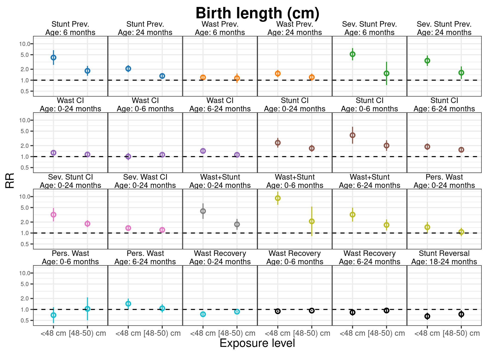<!-- --><!-- -->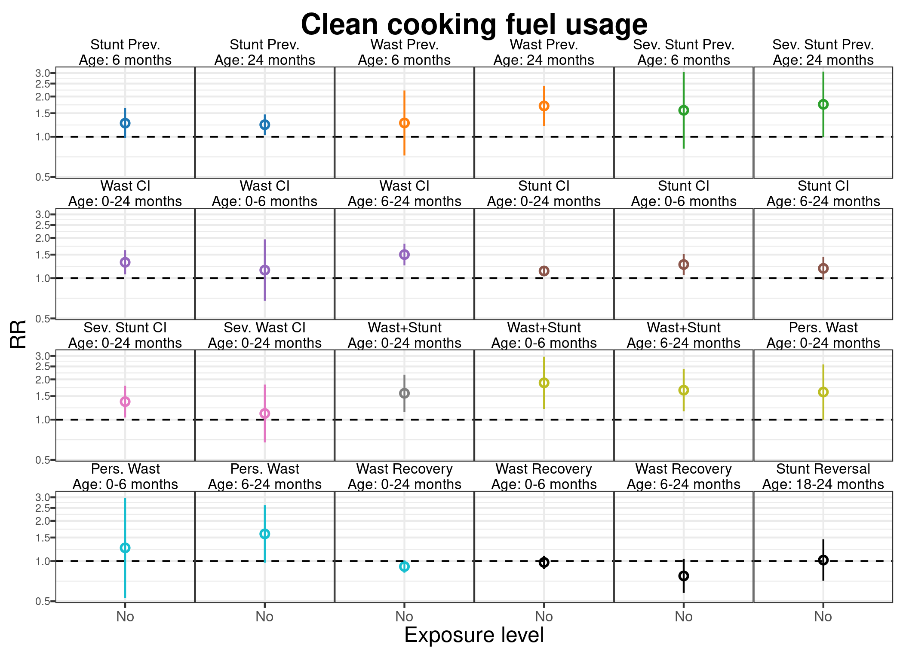<!-- --><!-- --><!-- -->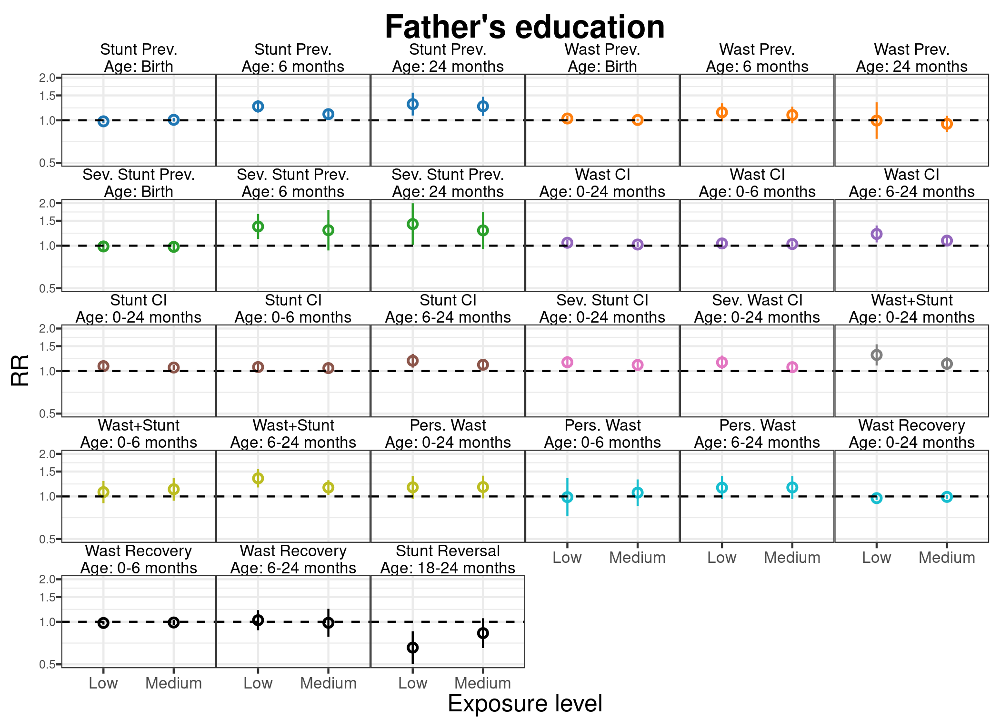<!-- --><!-- --><!-- --><!-- --><!-- --><!-- --><!-- -->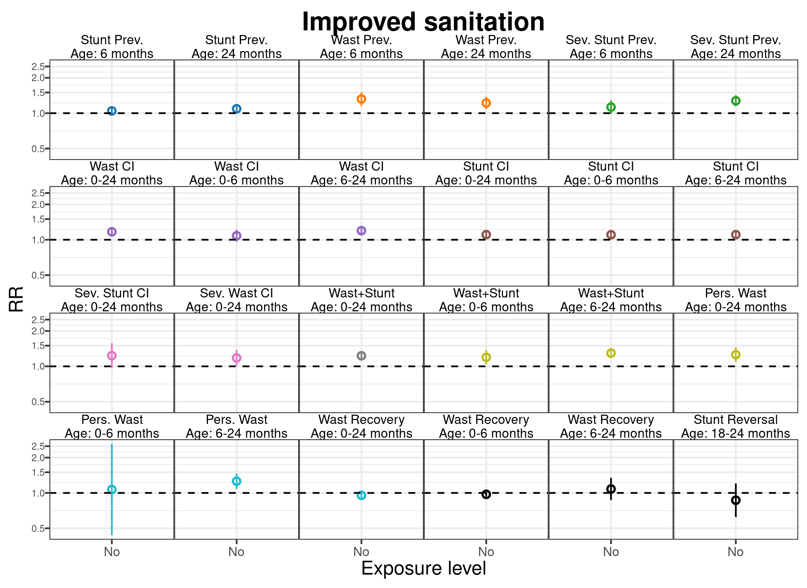<!-- -->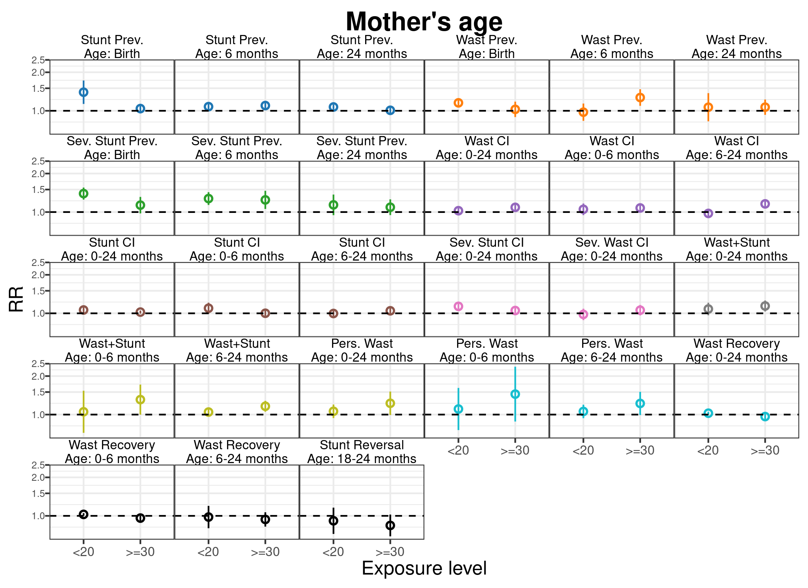<!-- -->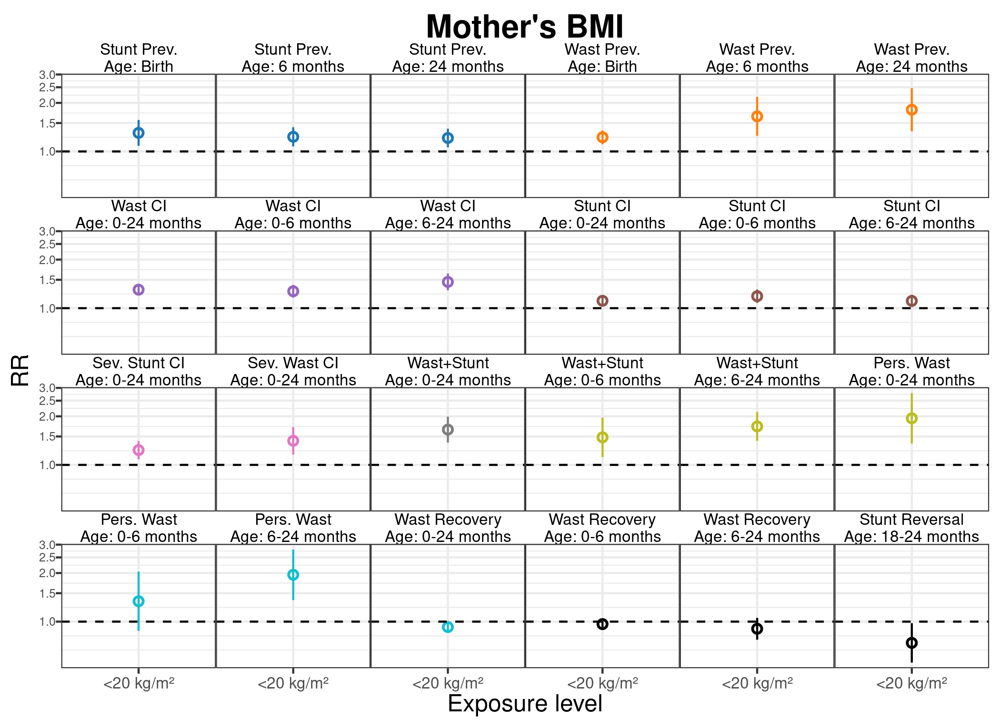<!-- -->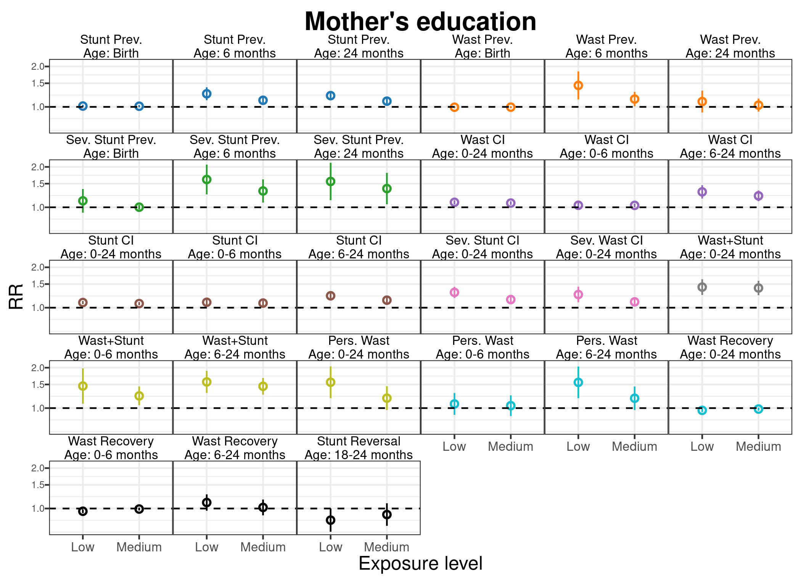<!-- -->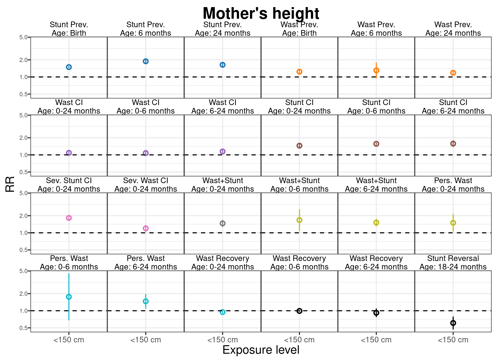<!-- --><!-- --><!-- --><!-- -->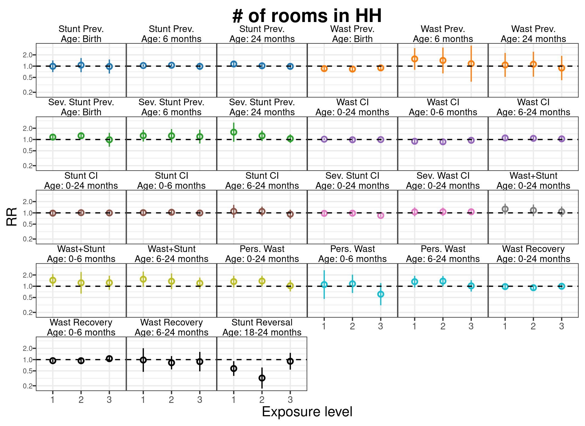<!-- -->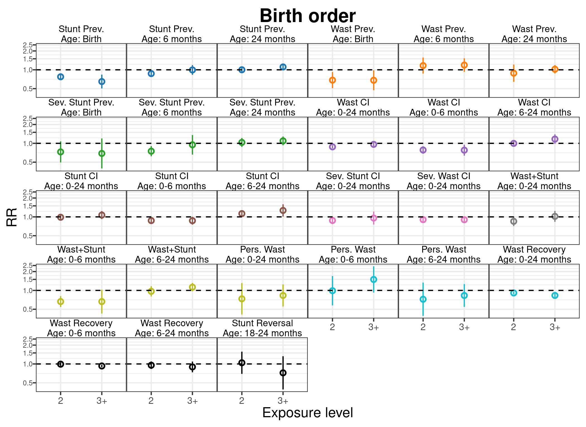<!-- -->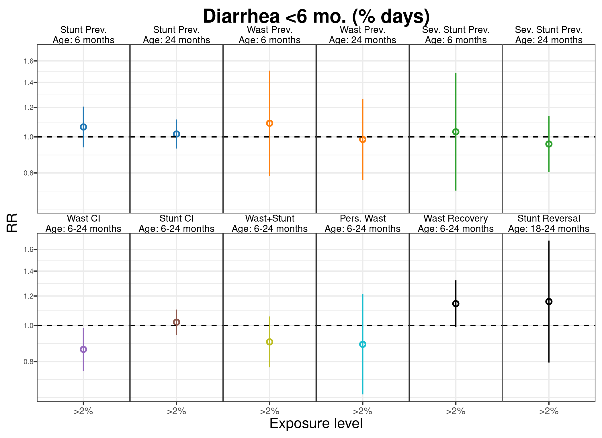<!-- -->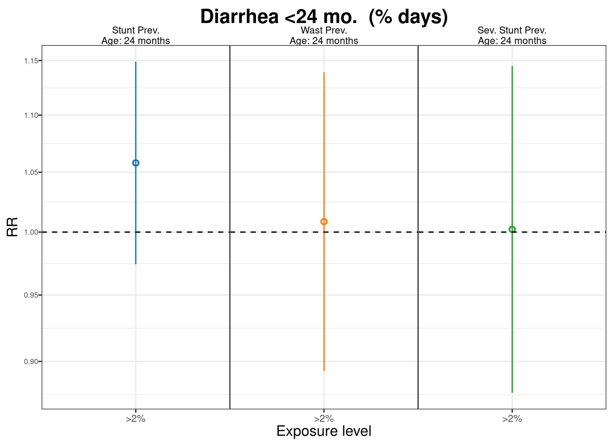<!-- -->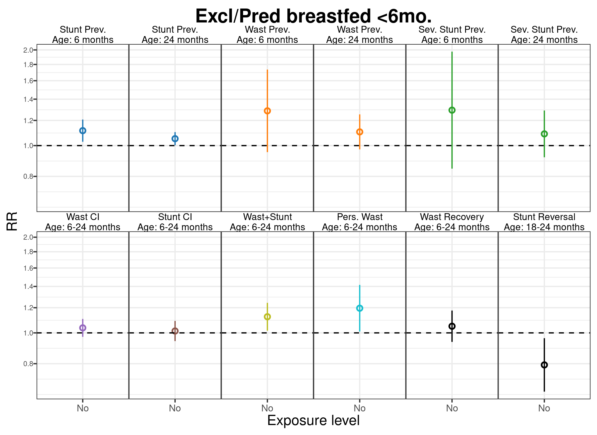<!-- -->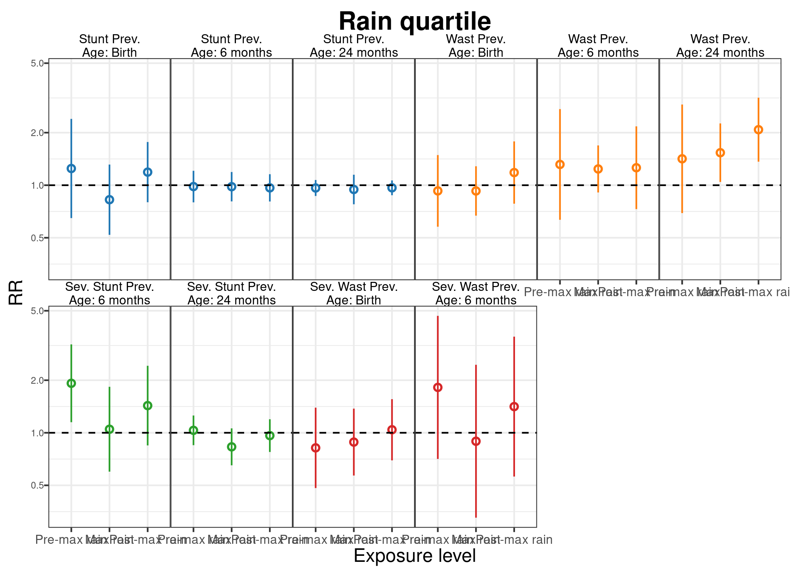<!-- --><!-- --><!-- --><!-- -->
