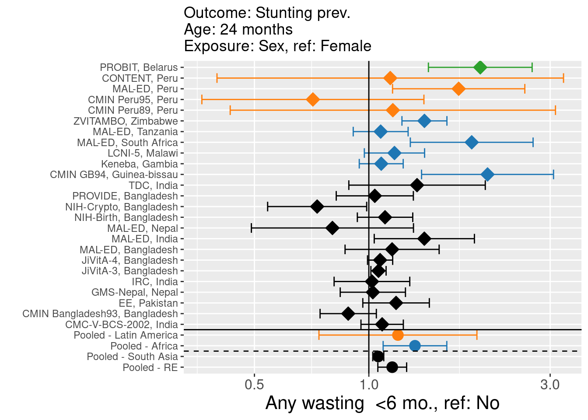

# Forest plots of relative risk {#RR-forest}

---
output:
  pdf_document:
    keep_tex: yes
fontfamily: mathpazo
fontsize: 9pt
---

\raggedright

## Overview

__Purpose: __ These plots show all results estimated in this study. Cohort-specific results were estimated for each combination of risk factor, outcome, and age category, and then pooled with random- and fixed-effects meta-analysis models.
__Interpretation: __ Each plot shows all cohort-specific estimates for each isk factor, outcome,  age category, and exposure level in the same style as Extended Data Figure 1. Cohort-specific estimates are plotted on each row, comparing the risk of an exposure level to the reference level.  Below the solid horizontal line are region-specific pooled measures of association, pooled using random-effects models. Below the dashed line are overall pooled measures of association, comparing pooling using random or fixed effects models. 
__Implications: __ The plots show all cohort-specific estimates underlying the primary plots in the manuscript as well as the pooled random- and fixed-effects estimates.


(Interactive seaching and selecting of forest plots in development. Example plot shown here for the moment.)


<!-- ** [Coming soon] Will fill in with all primary forest plots - right now this page is empty due to the file size/difficuty publishing all the plots ** -->


<!-- Group plots by exposure -->

<!-- ```{r  echo=FALSE, results='asis'} -->

<!--   #  df <- d #%>% filter() -->
<!--   # #Dynamic title -->
<!--   # cat(paste0("#### Outcome: ",df$outcome_variable[1]," Exposure: ", df$intervention_variable[1], " Age: ",  df$agecat[1])) -->

<!-- ``` -->


### Outcome: Stunting prev. Exposure: sex Age: 24 months 
,


