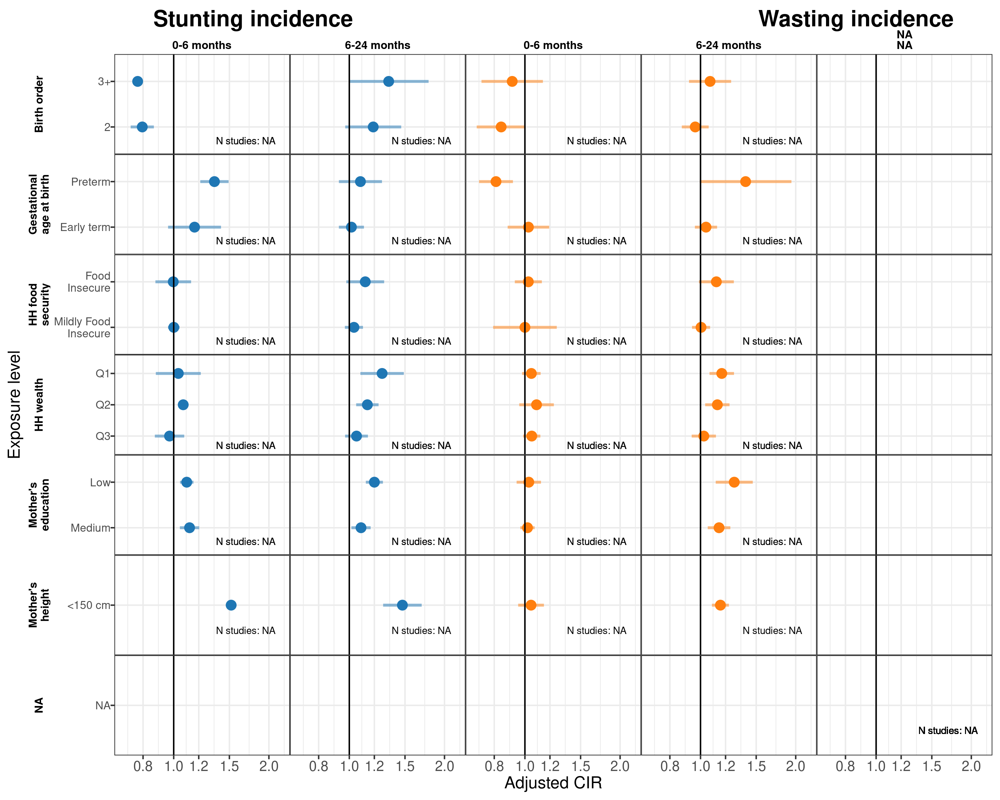
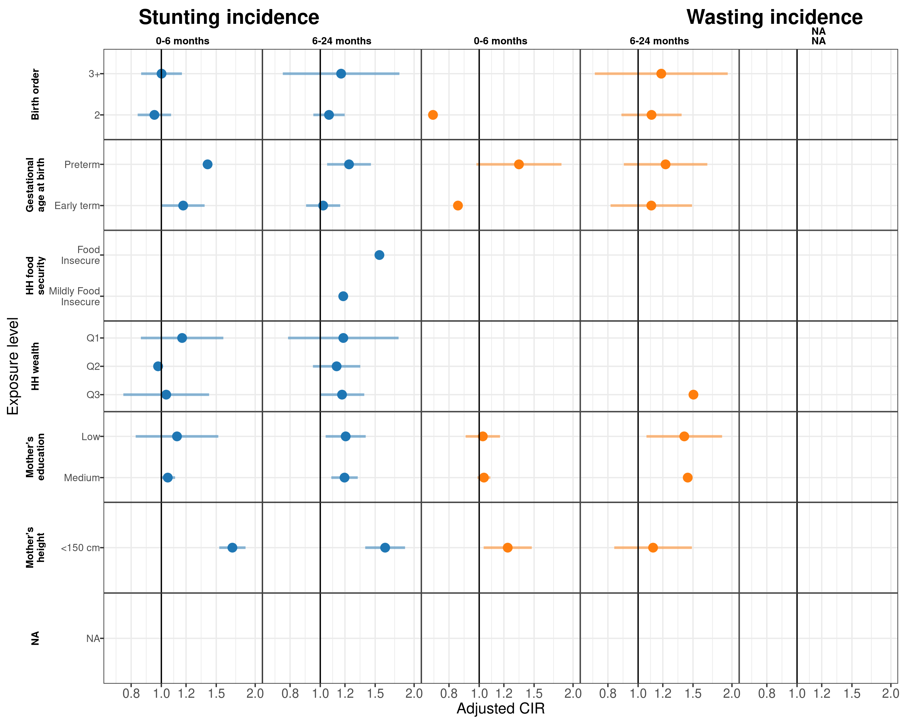
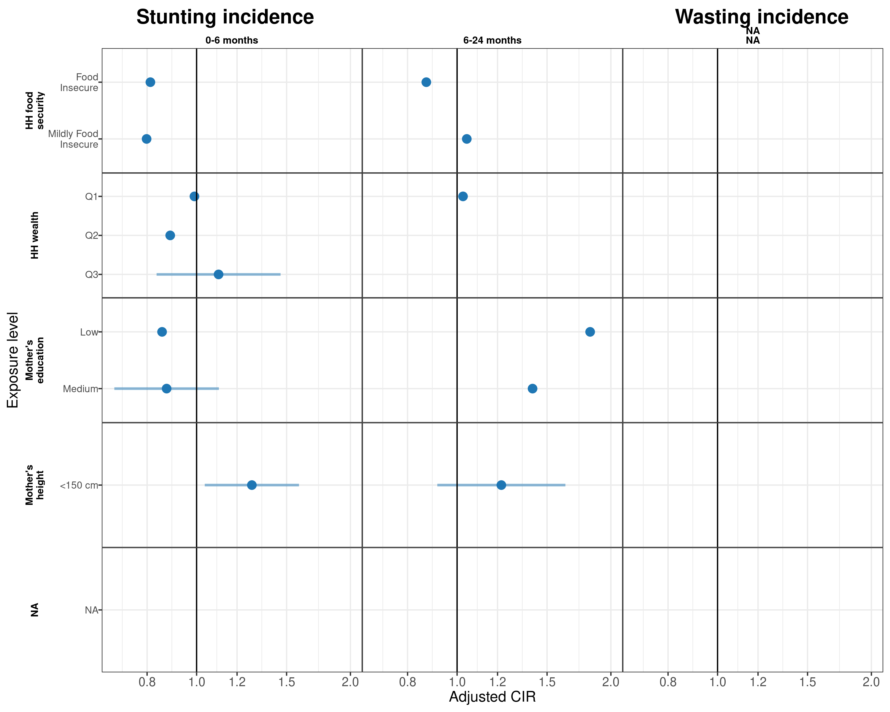
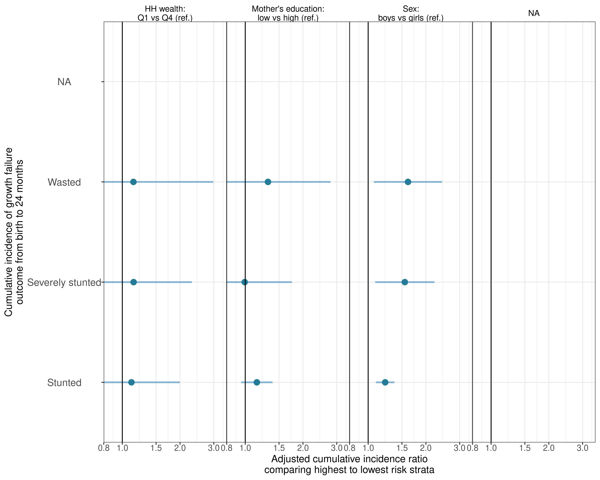

# Regionally-stratified plots {#RegionStrat}

---
output:
  pdf_document:
    keep_tex: yes
fontfamily: mathpazo
fontsize: 9pt
---

\raggedright

## Region and age-stratified population attributable differences in length-for-age Z-scores 

**South Asia** 

**Africa** 

**Latin America** 

## Region and age-stratified population attributable differences in weight-for-length Z-scores 

**South Asia** 

**Africa** 

**Latin America** 

## Region and age-stratified population attributable differences in weight-for-age Z-scores 

**South Asia** 

**Africa** 

**Latin America** 

## Associations between key exposures and wasting and stunting cumulative incidence, stratified by the age of the child and by region

**South Asia** 

**Africa** 

**Latin America** 

## Associations between key exposures and growth failure of different severities, stratified by region

**South Asia** 

**Africa** 

**Latin America** 

## Adjusted differences in linear growth velocity (in centimeters) across 3-month age 624 bands, by quartile of weight-for-length z-score (WLZ) in the preceding three months, stratified by region.

**South Asia** 

**Africa** 

**Latin America** 

