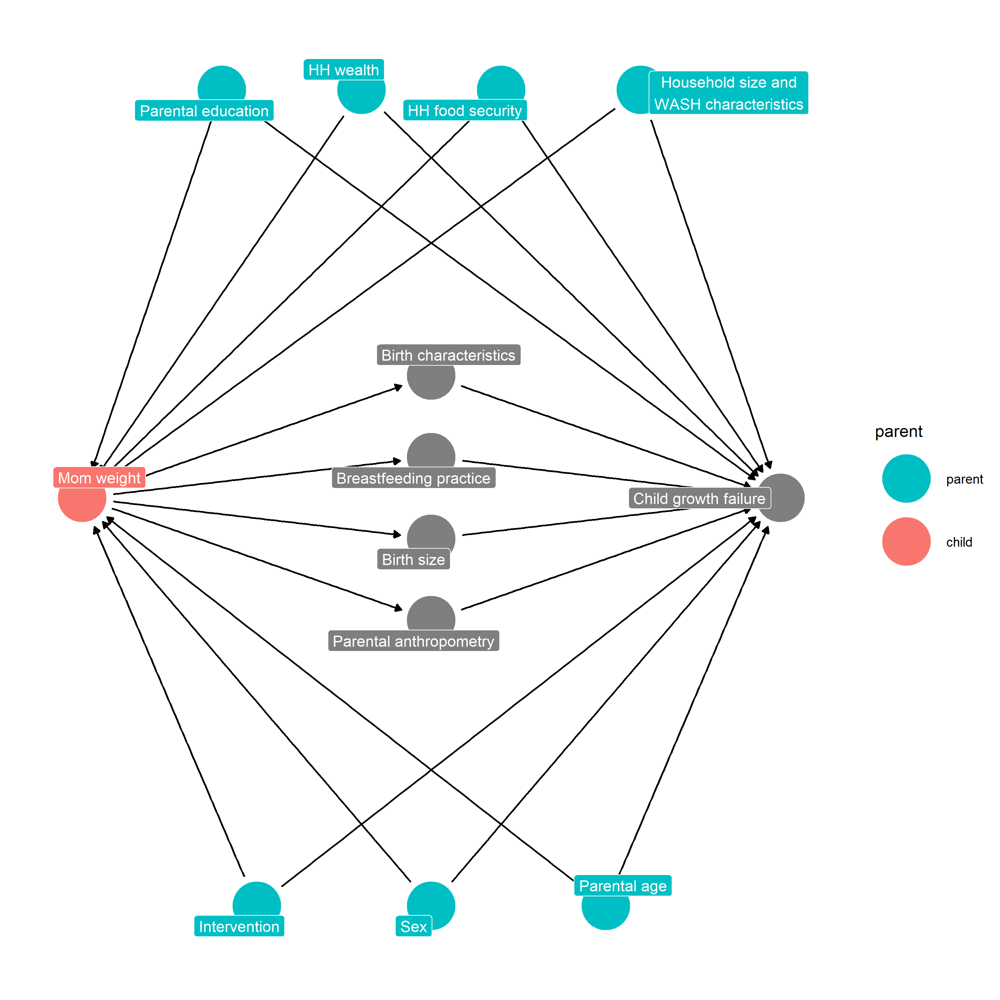

# Directed Acyclic Diagrams (DAGs) {#dags}

---
output:
  pdf_document:
    keep_tex: yes
fontfamily: mathpazo
fontsize: 9pt
---

\raggedright


## Overview

__Purpose: __
__Interpretation: __
__Implications: __


## Example DAG 


```
## Warning in file.copy(from = "/home/andrew.mertens/ki-longitudinal-manuscripts/
## figures/dags/", : problem reading directory /home/andrew.mertens/ki-
## longitudinal-manuscripts/figures/dags: Permission denied
```

```
## [1] FALSE
```



