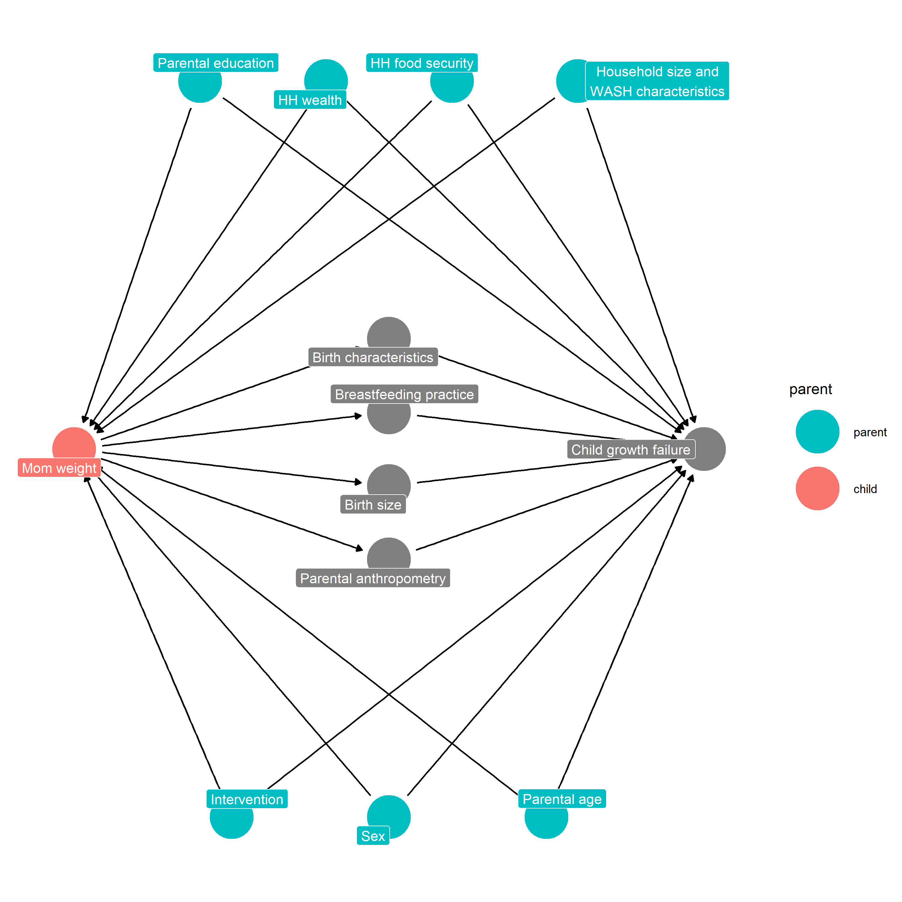

# Directed Acyclic Diagrams (DAGs) {#dags}

---
output:
  pdf_document:
    keep_tex: yes
fontfamily: mathpazo
fontsize: 9pt
---

\raggedright


## Overview

__Purpose: __
__Interpretation: __
__Implications: __


## Example DAG 


```
## Warning in file.copy(from = "/home/andrew.mertens/ki-longitudinal-manuscripts/
## figures/dags/", : problem reading directory /home/andrew.mertens/ki-
## longitudinal-manuscripts/figures/dags: Permission denied
```

```
## [1] FALSE
```



## Table of Adjustment Covariates


|A                          |B                                                                                                                                                                                                                                                                                                                                                                                                                                                                       |
|:--------------------------|:-----------------------------------------------------------------------------------------------------------------------------------------------------------------------------------------------------------------------------------------------------------------------------------------------------------------------------------------------------------------------------------------------------------------------------------------------------------------------|
|# of children <5 in HH     |arm           , W_mage        , W_fage        , meducyrs      , feducyrs      , hhwealth_quart, hfoodsec      , W_mhtcm       , W_mwtkg       , W_bmi         , W_fhtcm       , single        , W_nrooms      , W_parity      , trth2o        , cleanck       , impfloor      , impsan        , safeh20                                                                                                                                                                 |
|# of people in HH          |arm           , W_mage        , W_fage        , meducyrs      , feducyrs      , hhwealth_quart, hfoodsec      , W_mhtcm       , W_mwtkg       , W_bmi         , W_fhtcm       , single        , W_nrooms      , W_parity      , trth2o        , cleanck       , impfloor      , impsan        , safeh20                                                                                                                                                                 |
|# of rooms in HH           |arm           , sex           , W_mage        , W_fage        , meducyrs      , feducyrs      , hhwealth_quart, hfoodsec      , W_mhtcm       , W_mwtkg       , W_bmi         , W_fhtcm       , single        , W_nhh         , W_nchldlt5    , W_parity      , trth2o        , cleanck       , impfloor      , impsan        , safeh20                                                                                                                                 |
|Any wasting  <6 mo.        |arm           , sex           , W_mage        , W_fage        , meducyrs      , feducyrs      , hhwealth_quart, hfoodsec      , W_mhtcm       , W_mwtkg       , W_bmi         , W_fhtcm       , vagbrth       , hdlvry        , single        , W_nrooms      , W_nhh         , W_nchldlt5    , month         , brthmon       , W_parity      , trth2o        , cleanck       , impfloor      , impsan        , safeh20                                                 |
|Birth length (cm)          |arm           , sex           , W_mage        , W_fage        , meducyrs      , feducyrs      , hhwealth_quart, hfoodsec      , W_mhtcm       , W_mwtkg       , W_bmi         , W_fhtcm       , vagbrth       , hdlvry        , single        , W_nrooms      , W_nhh         , W_nchldlt5    , brthmon       , W_parity      , trth2o        , cleanck       , impfloor      , impsan        , safeh20                                                                 |
|Birth order                |arm           , W_mage        , W_fage        , meducyrs      , feducyrs      , hhwealth_quart, hfoodsec      , W_mhtcm       , W_mwtkg       , W_bmi         , W_fhtcm       , vagbrth       , hdlvry        , single        , W_nrooms      , trth2o        , cleanck       , impfloor      , impsan        , safeh20                                                                                                                                                 |
|Birthweight (kg)           |arm           , sex           , W_mage        , W_fage        , meducyrs      , feducyrs      , hhwealth_quart, hfoodsec      , W_mhtcm       , W_mwtkg       , W_bmi         , W_fhtcm       , vagbrth       , hdlvry        , single        , W_nrooms      , W_nhh         , W_nchldlt5    , brthmon       , W_parity      , trth2o        , cleanck       , impfloor      , impsan        , safeh20                                                                 |
|Breastfed hour after birth |arm           , sex           , W_mage        , W_fage        , meducyrs      , feducyrs      , hhwealth_quart, hfoodsec      , W_mhtcm       , W_mwtkg       , W_bmi         , W_fhtcm       , vagbrth       , hdlvry        , W_gagebrth    , W_birthwt     , W_birthlen    , single        , W_nrooms      , W_nhh         , W_nchldlt5    , brthmon       , W_parity      , trth2o        , cleanck       , impfloor      , impsan        , safeh20                 |
|Child delivered at home    |arm           , sex           , W_mage        , W_fage        , meducyrs      , feducyrs      , hhwealth_quart, hfoodsec      , W_mhtcm       , W_mwtkg       , W_bmi         , W_fhtcm       , single        , W_nrooms      , W_nhh         , W_nchldlt5    , brthmon       , W_parity      , trth2o        , cleanck       , impfloor      , impsan        , safeh20                                                                                                 |
|Clean cooking fuel usage   |arm           , sex           , W_mage        , W_fage        , meducyrs      , feducyrs      , hhwealth_quart, hfoodsec      , W_mhtcm       , W_mwtkg       , W_bmi         , W_fhtcm       , single        , W_nrooms      , W_nhh         , W_nchldlt5    , W_parity      , trth2o        , impfloor      , impsan        , safeh20                                                                                                                                 |
|Diarrhea <24 mo.  (% days) |arm           , sex           , W_mage        , W_fage        , meducyrs      , feducyrs      , hhwealth_quart, hfoodsec      , W_mhtcm       , W_mwtkg       , W_bmi         , W_fhtcm       , vagbrth       , hdlvry        , W_gagebrth    , W_birthwt     , W_birthlen    , single        , W_nrooms      , W_nhh         , W_nchldlt5    , month         , brthmon       , W_parity      , trth2o        , cleanck       , impfloor      , impsan        , safeh20 |
|Diarrhea <6 mo. (% days)   |arm           , sex           , W_mage        , W_fage        , meducyrs      , feducyrs      , hhwealth_quart, hfoodsec      , W_mhtcm       , W_mwtkg       , W_bmi         , W_fhtcm       , vagbrth       , hdlvry        , W_gagebrth    , W_birthwt     , W_birthlen    , single        , W_nrooms      , W_nhh         , W_nchldlt5    , month         , brthmon       , W_parity      , trth2o        , cleanck       , impfloor      , impsan        , safeh20 |
|Excl/Pred breastfed <6mo.  |arm           , sex           , W_mage        , W_fage        , meducyrs      , feducyrs      , hhwealth_quart, hfoodsec      , W_mhtcm       , W_mwtkg       , W_bmi         , W_fhtcm       , vagbrth       , hdlvry        , W_gagebrth    , W_birthwt     , W_birthlen    , single        , W_nrooms      , W_nhh         , W_nchldlt5    , month         , brthmon       , W_parity      , trth2o        , cleanck       , impfloor      , impsan        , safeh20 |
|fage_rf                    |arm           , W_mage        , meducyrs      , feducyrs      , hhwealth_quart, hfoodsec      , W_mhtcm       , W_mwtkg       , W_bmi         , W_fhtcm       , single        , W_nrooms      , W_nhh         , W_nchldlt5    , brthmon       , trth2o        , cleanck       , impfloor      , impsan        , safeh20                                                                                                                                                 |
|Father's age               |arm           , W_mage        , meducyrs      , feducyrs      , hhwealth_quart, hfoodsec      , W_mhtcm       , W_mwtkg       , W_bmi         , W_fhtcm       , single        , W_nrooms      , W_nhh         , W_nchldlt5    , brthmon       , trth2o        , cleanck       , impfloor      , impsan        , safeh20                                                                                                                                                 |
|Father's education         |arm           , W_mage        , W_fage        , meducyrs      , hhwealth_quart, W_mhtcm       , W_mwtkg       , W_bmi         , W_fhtcm       , W_gagebrth    , W_birthwt     , W_birthlen    , single        , W_nrooms      , W_nhh         , W_nchldlt5    , trth2o        , cleanck       , impfloor      , impsan        , safeh20                                                                                                                                 |
|Father's height            |arm           , W_mage        , W_fage        , meducyrs      , feducyrs      , hhwealth_quart, hfoodsec      , W_mhtcm       , W_mwtkg       , W_bmi         , single        , W_nrooms      , trth2o        , cleanck       , impfloor      , impsan        , safeh20                                                                                                                                                                                                 |
|fhtcm_rf                   |arm           , W_mage        , W_fage        , meducyrs      , feducyrs      , hhwealth_quart, hfoodsec      , W_mhtcm       , W_mwtkg       , W_bmi         , single        , W_nrooms      , trth2o        , cleanck       , impfloor      , impsan        , safeh20                                                                                                                                                                                                 |
|Gestational age at birth   |arm           , sex           , W_mage        , W_fage        , meducyrs      , feducyrs      , hhwealth_quart, hfoodsec      , W_mhtcm       , W_mwtkg       , W_bmi         , W_fhtcm       , single        , W_nrooms      , W_nhh         , W_nchldlt5    , brthmon       , W_parity      , trth2o        , cleanck       , impfloor      , impsan        , safeh20                                                                                                 |
|HH food security           |arm           , sex           , W_mage        , W_fage        , meducyrs      , feducyrs      , hhwealth_quart, vagbrth       , hdlvry        , single        , W_nrooms      , W_nhh         , W_nchldlt5    , brthmon       , W_parity      , trth2o        , cleanck       , impfloor      , impsan        , safeh20                                                                                                                                                 |
|HH wealth                  |arm       , sex       , W_mage    , W_fage    , meducyrs  , feducyrs  , W_gagebrth, W_birthwt , W_birthlen, single    , W_nhh     , W_nchldlt5, W_parity                                                                                                                                                                                                                                                                                                                |
|Improved floor             |arm           , sex           , W_mage        , W_fage        , meducyrs      , feducyrs      , hhwealth_quart, hfoodsec      , W_mhtcm       , W_mwtkg       , W_bmi         , W_fhtcm       , single        , W_nrooms      , W_nhh         , W_nchldlt5    , W_parity      , trth2o        , cleanck       , impsan        , safeh20                                                                                                                                 |
|Improved sanitation        |arm           , sex           , W_mage        , W_fage        , meducyrs      , feducyrs      , hhwealth_quart, hfoodsec      , W_mhtcm       , W_mwtkg       , W_bmi         , W_fhtcm       , single        , W_nrooms      , W_nhh         , W_nchldlt5    , W_parity      , trth2o        , cleanck       , impfloor      , safeh20                                                                                                                                 |
|Mother's age               |arm           , W_fage        , meducyrs      , feducyrs      , hhwealth_quart, hfoodsec      , W_mhtcm       , W_mwtkg       , W_bmi         , W_fhtcm       , single        , W_nrooms      , W_nhh         , W_nchldlt5    , trth2o        , cleanck       , impfloor      , impsan        , safeh20                                                                                                                                                                 |
|Mother's BMI               |arm           , W_mage        , W_fage        , meducyrs      , feducyrs      , hhwealth_quart, hfoodsec      , W_fhtcm       , single        , W_nrooms      , W_nhh         , W_nchldlt5    , brthmon       , W_parity      , trth2o        , cleanck       , impfloor      , impsan        , safeh20                                                                                                                                                                 |
|Mother's education         |arm           , W_mage        , W_fage        , feducyrs      , hhwealth_quart, W_mhtcm       , W_mwtkg       , W_bmi         , W_fhtcm       , W_gagebrth    , W_birthwt     , W_birthlen    , single        , W_nrooms      , W_nhh         , W_nchldlt5    , trth2o        , cleanck       , impfloor      , impsan        , safeh20                                                                                                                                 |
|Mother's height            |arm           , W_mage        , W_fage        , meducyrs      , feducyrs      , hhwealth_quart, hfoodsec      , W_fhtcm       , single        , W_nrooms      , trth2o        , cleanck       , impfloor      , impsan        , safeh20                                                                                                                                                                                                                                 |
|Mother's weight            |arm           , W_mage        , W_fage        , meducyrs      , feducyrs      , hhwealth_quart, hfoodsec      , W_fhtcm       , single        , W_nrooms      , W_nhh         , W_nchldlt5    , brthmon       , W_parity      , trth2o        , cleanck       , impfloor      , impsan        , safeh20                                                                                                                                                                 |
|Persistent wasting  <6 mo. |arm           , sex           , W_mage        , W_fage        , meducyrs      , feducyrs      , hhwealth_quart, hfoodsec      , W_mhtcm       , W_mwtkg       , W_bmi         , W_fhtcm       , vagbrth       , hdlvry        , single        , W_nrooms      , W_nhh         , W_nchldlt5    , month         , brthmon       , W_parity      , trth2o        , cleanck       , impfloor      , impsan        , safeh20                                                 |
|Safe water source          |arm           , sex           , W_mage        , W_fage        , meducyrs      , feducyrs      , hhwealth_quart, hfoodsec      , W_mhtcm       , W_mwtkg       , W_bmi         , W_fhtcm       , single        , W_nrooms      , W_nhh         , W_nchldlt5    , W_parity      , trth2o        , cleanck       , impfloor      , impsan                                                                                                                                  |
|Single parent              |arm           , W_mage        , W_fage        , meducyrs      , feducyrs      , hhwealth_quart, hfoodsec      , W_mhtcm       , W_mwtkg       , W_bmi         , W_fhtcm       , W_nrooms      , W_nhh         , W_nchldlt5    , trth2o        , cleanck       , impfloor      , impsan        , safeh20                                                                                                                                                                 |
|Treats drinking water      |arm           , sex           , W_mage        , W_fage        , meducyrs      , feducyrs      , hhwealth_quart, hfoodsec      , W_mhtcm       , W_mwtkg       , W_bmi         , W_fhtcm       , single        , W_nrooms      , W_nhh         , W_nchldlt5    , brthmon       , W_parity      , cleanck       , impfloor      , impsan        , safeh20                                                                                                                 |
|Vaginal birth              |arm           , sex           , W_mage        , W_fage        , meducyrs      , feducyrs      , hhwealth_quart, hfoodsec      , W_mhtcm       , W_mwtkg       , W_bmi         , W_fhtcm       , hdlvry        , single        , W_nrooms      , W_nhh         , W_nchldlt5    , brthmon       , W_parity      , trth2o        , cleanck       , impfloor      , impsan        , safeh20                                                                                 |
