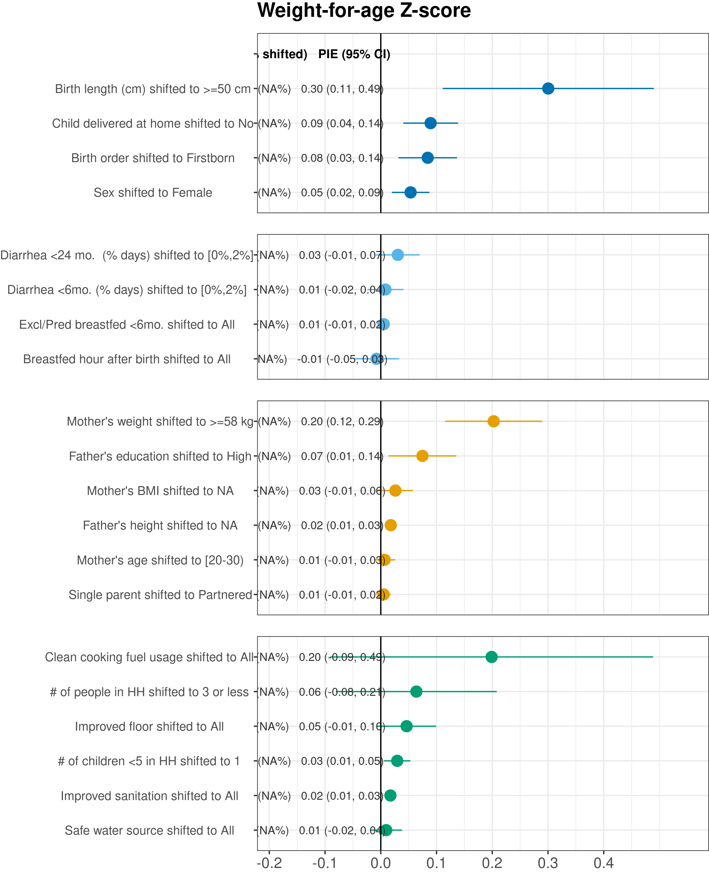

# Population intervention effects on weight-for-age Z-scores {#population}

---
output:
  pdf_document:
    keep_tex: yes
fontfamily: mathpazo
fontsize: 9pt
---

__Purpose: __ This figure replicates Figure 2 from the primary manuscript, but with child weight-for-age Z-scores as the outcome. The figure shows population intervention effects on child WAZ at age 24 months. Exposures were rank ordered, and each exposure label includes the reference level used to estimate population intervention effects, shifting exposures for all children from their observed exposure to the reference level. Cohort-specific estimates were adjusted for all measured confounders using ensemble machine learning and TMLE, and then pooled using random effects (Methods). Columns for each exposure summarize the number of children that contributed to each analysis and the percentage of children for whom exposure was shifted to the reference level, and the estimated population intervention effect (PIE) and 95% confidence interval.

__Interpretation: __ Because weight is a function of both skeletal weight (primarily from length) and body muscle and fat, WAZ is a combination of LAZ and WLZ. We expect to see similiarly important exposures as for LAZ and WAZ.

__Implications: __ The strength of associations between exposures and WAZ at 24 months is roughly an average of the strengths of associations between exposures and LAZ and WLZ shown in figure 2. There were no unexpected associations when using WAZ as an outcome.

\raggedright

### Figure

<!-- -->
